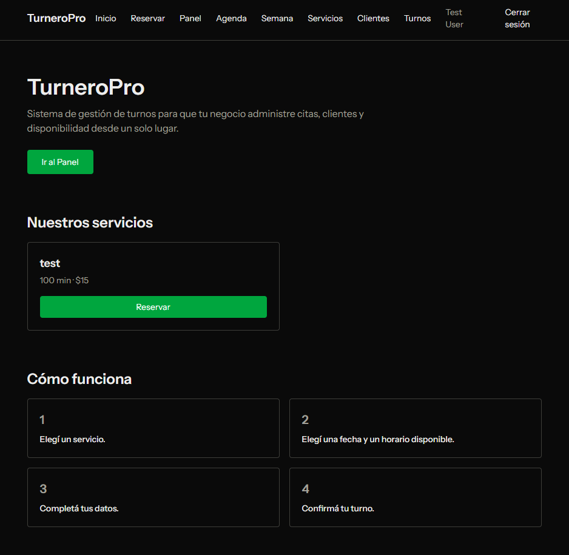

# TurneroPro 📅

Sistema de gestión de turnos para negocios: reserva online, confirmación por email y un panel de administración para gestionar servicios, clientes y la agenda diaria y semanal.

> Proyecto de portafolio construido con [Laravel](https://laravel.com), [Tailwind CSS](https://tailwindcss.com), [SQLite](https://www.sqlite.org) y [Pest](https://pestphp.com).

## ✨ Funcionalidades

### Para el público
- **Reserva online sin registrarse**: elegí servicio, fecha, horario y dejá tus datos.
- **Confirmación por email**: al reservar se envía un correo (markdown) con el detalle del turno y un botón para cancelarlo.
- **"Mi turno"**: buscá tus turnos con tu email y cancelalos con un solo clic.
- **Landing pública**: servicios, horarios de atención y preguntas frecuentes.
- **Días y horarios de atención configurables**: los horarios solo se ofrecen en días hábiles dentro del horario del local.

### Panel de administración (requiere login)
- **Dashboard con KPIs**: turnos de hoy, pendientes, clientes y servicios.
- **Agenda diaria**: turnos ordenados por hora con acciones de completar/cancelar.
- **Agenda semanal**: vista de la semana por columnas (y apilada en móvil), con días cerrados resaltados.
- **CRUD de servicios, clientes y turnos**, con protección para no borrar datos en uso.
- **Configuración del local**: horario de apertura/cierre y días de atención.
- **Protección de rutas** con autenticación y **rate limiting** en reservas y login.
- **Diseño responsive** con dark mode.

## 🖼️ Capturas

_Agregá capturas de pantalla en `docs/` y referencialas acá, por ejemplo:_

- `docs/inicio.png`
- `docs/panel.png`
- `docs/agenda.png`
- `docs/reserva.png`

```

```

## 🚀 Requisitos

- PHP **8.3+**
- Composer
- Node.js + npm
- SQLite (incluido en PHP)

## 📦 Instalación

```bash
# 1. Cloná el repositorio
git clone https://github.com/tu-usuario/turneropro.git
cd turneropro

# 2. Instalá las dependencias de PHP
composer install

# 3. Configurá el entorno
cp .env.example .env
php artisan key:generate

# 4. Creá la base de datos SQLite
# En Windows: New-Item database\database.sqlite
php artisan migrate --seed

# 5. Instalá y compilá los assets frontend
npm install
npm run build

# 6. Levantá el servidor
php artisan serve
```

Abrí `http://localhost:8000` en tu navegador.

### Credenciales de demo

El seeder carga el usuario administrador:

- **Email:** `test@example.com`
- **Contraseña:** (definida en `UserFactory`, el valor por defecto de Laravel)

> También se crean 4 servicios, 3 clientes y turnos de ejemplo para ver el proyecto lleno de datos.

## 🧪 Tests

```bash
php artisan test
```

El proyecto incluye **124 tests / 422 aserciones** cubriendo: reserva pública, cancelación, confirmación por email, agenda diaria y semanal, CRUD de servicios/clientes/turnos, configuración del local, autenticación, rate limiting y días de atención.

## 🗂️ Estructura del proyecto

```
app/
├── Enums/                  # AppointmentStatus
├── Http/Controllers/       # Booking, Agenda, Service, Client, Appointment, Auth, Panel...
├── Mail/                   # ReservaConfirmada (email de confirmación)
├── Models/                 # Appointment, Client, Service, StoreSetting
└── Services/               # AvailabilityService (disponibilidad y solapamientos)
database/
├── factories/              # Factories para tests y seeders
└── seeders/                # StoreSettingSeeder + DemoDataSeeder
resources/views/            # Vistas Blade (públicas y panel)
routes/web.php              # Definición de rutas
tests/                      # Suite Pest (Feature + Unit)
```

## 🚀 Deploy (checklist)

1. En `.env`: `APP_ENV=production`, `APP_DEBUG=false`, configurá `APP_URL` con tu dominio, `SESSION_SECURE_COOKIE=true` y un **SMTP real** para los emails de confirmación.
2. Instalá dependencias sin dev: `composer install --no-dev --optimize-autoloader`.
3. Migrá la base: `php artisan migrate --force`.
4. Compilá los assets: `npm ci && npm run build` (el directorio `public/build` **no viaja** en el repo, porque está en `.gitignore`).
5. Cacheá: `php artisan config:cache`, `route:cache`, `view:cache`.
6. Creá el enlace de storage si usás archivos: `php artisan storage:link`.

## 🛠️ Stack técnico

- **Backend:** Laravel 13 (PHP 8.3+), Eloquent, Blade, rate limiting.
- **Frontend:** Tailwind CSS 4, Vite 8.
- **Base de datos:** SQLite (ideal para portafolio y demo).
- **Testing:** Pest 5.

## 📄 Licencia

[MIT](https://opensource.org/licenses/MIT)
